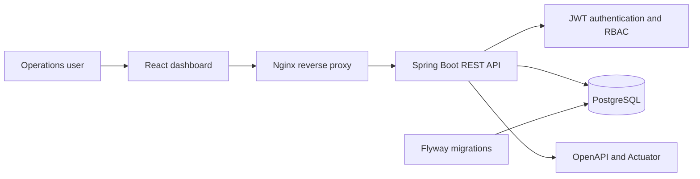

# StockPilot

[](https://github.com/PabloVA02/stockpilot/actions/workflows/ci.yml)

Full-stack inventory platform designed for small operations teams that need to control products, stock movements and replenishment alerts.

The project combines a production-style Java API with a TypeScript dashboard and a PostgreSQL database. It focuses on business rules, transactional consistency, security, automated tests and reproducible deployment.

## Why this project matters

Inventory software is more than CRUD. An outbound movement must never create negative stock, concurrent operations must remain consistent, permissions must separate read and write actions, and every change must be traceable. StockPilot models those constraints explicitly.

## Main features

- Product catalogue with validation, search and pagination.
- Inbound and outbound stock movements with an auditable history.
- Transactional stock updates with database locking.
- Low-stock indicators and operational dashboard.
- Stateless JWT authentication with short-lived tokens and role-based access: `VIEWER` for queries and `MANAGER` for changes.
- Uniform RFC 9457-style errors for authentication, authorization, malformed JSON, invalid parameters and business rules.
- End-to-end `X-Request-Id` correlation in responses, errors and logs for support diagnostics.
- Stable, bounded pagination contracts rather than exposing framework-internal page objects.
- OpenAPI documentation and interactive Swagger UI.
- Database migrations and demo data with Flyway.
- Responsive React dashboard with server-state caching and accessible pagination controls.
- Unit, security and API integration tests, with a JaCoCo coverage gate in GitHub Actions.
- Complete local environment with Docker Compose.

## Technology stack

### Backend

- Java 21
- Spring Boot 4
- Spring Web, Spring Data JPA and Spring Security
- Spring Security OAuth 2.0 Resource Server and signed JWTs
- PostgreSQL 18 and Flyway
- Maven, JUnit 5, Mockito and AssertJ
- springdoc-openapi / Swagger UI
- Spring Boot Actuator

### Frontend

- TypeScript 7
- React 19
- Vite 8
- TanStack Query
- Vitest and React Testing Library

### Delivery

- Docker and Docker Compose
- GitHub Actions CI
- Nginx reverse proxy

## Architecture



More detail is available in [`docs/architecture.md`](docs/architecture.md).

## Run with Docker

Requirements: Docker Desktop with Docker Compose.

```bash
cp .env.example .env
# Fill every blank secret in .env before continuing.
docker compose up --build
```

Compose refuses to start if the PostgreSQL password, either application password, or the JWT signing secret is blank. Generate independent random values: application passwords must contain at least 12 characters and the JWT secret at least 32 bytes. `.env` is excluded from both Git and Docker build contexts.

Services:

- Dashboard: <http://localhost:3000>
- API: <http://localhost:8080/api/v1>
- Swagger UI through the dashboard proxy: <http://localhost:3000/swagger-ui.html>
- Swagger UI directly from the API: <http://localhost:8080/swagger-ui.html>
- Health: <http://localhost:8080/actuator/health>

The dashboard link uses Nginx routes for both `/swagger-ui/**` and `/v3/api-docs/**`, so interactive documentation also works from the Docker web entry point.

## Run for development

Start PostgreSQL locally with the `stockpilot` database and user. The isolated `dev` profile expects password `stockpilot-local` unless `DATABASE_PASSWORD` is supplied.

Start the backend with explicit development-only defaults:

```bash
./mvnw spring-boot:run -Dspring-boot.run.profiles=dev
```

Start the frontend in another terminal:

```bash
cd frontend
npm ci
npm run dev
```

## Test

```bash
./mvnw verify
cd frontend && npm test -- --run
```

## API examples

Set the user and password configured for the current environment, then exchange them for a 15-minute JWT. Docker uses the values you entered in `.env`; the `dev` profile uses `viewer` / `viewer-local` only on the developer machine.

```bash
export STOCKPILOT_LOGIN_USER="viewer"
export STOCKPILOT_LOGIN_PASSWORD="<configured viewer password>"
curl -X POST \
  -H "Content-Type: application/json" \
  -d "{\"username\":\"$STOCKPILOT_LOGIN_USER\",\"password\":\"$STOCKPILOT_LOGIN_PASSWORD\"}" \
  http://localhost:8080/api/v1/auth/token
```

Copy the returned `accessToken`, then call protected endpoints:

```bash
export STOCKPILOT_TOKEN="<accessToken>"
curl -H "Authorization: Bearer $STOCKPILOT_TOKEN" \
  "http://localhost:8080/api/v1/products?size=20"
```

Repeat the token exchange with the configured `manager` credentials, update `STOCKPILOT_TOKEN`, and register an outbound movement:

```bash
curl -H "Authorization: Bearer $STOCKPILOT_TOKEN" \
  -H "Content-Type: application/json" \
  -H "X-Request-Id: demo-order-1042" \
  -d '{"type":"OUTBOUND","quantity":2,"reason":"Customer order","reference":"ORDER-1042"}' \
  http://localhost:8080/api/v1/products/11111111-1111-1111-1111-111111111111/movements
```

Every response includes `X-Request-Id`. The same identifier is attached to structured application errors and the completed-request log entry (`method`, `path`, `status` and `durationMs`). The dashboard shows that reference when a request fails, so a user-visible error can be matched to one backend request. Authenticated managers can inspect Actuator metrics at `/actuator/metrics`.

## Engineering decisions

- **Pessimistic locking** protects stock updates from concurrent write conflicts.
- **Stateless JWTs** keep API authorization independent of server sessions; issuer and expiry are validated on every request.
- **Soft deactivation** preserves historical movement data.
- **DTOs at the API boundary** keep persistence details out of the contract.
- **Explicit page DTOs and a maximum page size** keep list responses stable and resource usage bounded.
- **Allow-listed sorting plus an ID tie-breaker** prevents invalid persistence properties and makes page traversal deterministic.
- **Request correlation** connects client-visible failures with a completed-request log trail without trusting unsafe header values.
- **One Problem Details contract** covers controller validation and Spring Security's 401/403 paths.
- **Flyway migrations** make database changes explicit and reproducible.
- **Externalized credentials and signing configuration** keep production secrets out of source control.
- **Separate base and `dev` profiles** provide local convenience without shipping known deployment credentials.
- **Dedicated Docker ignore files** prevent repositories, secrets, dependencies and build outputs entering image contexts.
- **Integration tests and an 80% line-coverage gate** verify security, persistence and business rules before a build can pass. Mockito is attached at test-JVM startup, avoiding unsupported runtime agent attachment on Java 21.
- **Independent CI jobs** verify Java, TypeScript and both container build contexts. Container CI also recreates PostgreSQL 18 and proves that its named-volume data survives.

## Roadmap

- Replace the local credential verifier and symmetric signing key with an external OpenID Connect identity provider.
- Add CSV import with an asynchronous processing queue.
- Add movement charts and date filters to the dashboard.
- Add Testcontainers compatibility tests against PostgreSQL in addition to the fast H2 integration suite.
- Deploy a demonstration environment with managed secrets and observability.

## Author

Pablo Verdejo Alonso — [LinkedIn](https://www.linkedin.com/in/pablo-verdejo-alonso-7b9427371)

Portfolio project developed with AI-assisted engineering. Architecture, implementation and trade-offs are documented so that every decision can be reviewed and explained.

## License

MIT
