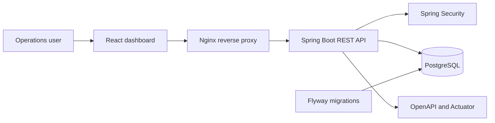

# StockPilot

[](https://github.com/PabloVA02/stockpilot/actions/workflows/ci.yml)

Full-stack inventory platform designed for small operations teams that need to control products, stock movements and replenishment alerts.

The project combines a production-style Java API with a TypeScript dashboard and a PostgreSQL database. It focuses on business rules, transactional consistency, security, automated tests and reproducible deployment.

## Why this project matters

Inventory software is more than CRUD. An outbound movement must never create negative stock, concurrent operations must remain consistent, permissions must separate read and write actions, and every change must be traceable. StockPilot models those constraints explicitly.

## Main features

- Product catalogue with validation, search and pagination.
- Inbound and outbound stock movements with an auditable history.
- Transactional stock updates with database locking.
- Low-stock indicators and operational dashboard.
- Role-based access: `VIEWER` for queries and `MANAGER` for changes.
- RFC 9457-style error responses with validation details.
- OpenAPI documentation and interactive Swagger UI.
- Database migrations and demo data with Flyway.
- Responsive React dashboard with server-state caching.
- Automated backend and frontend tests in GitHub Actions.
- Complete local environment with Docker Compose.

## Technology stack

### Backend

- Java 21
- Spring Boot 4
- Spring Web, Spring Data JPA and Spring Security
- PostgreSQL 18 and Flyway
- Maven, JUnit 5, Mockito and AssertJ
- springdoc-openapi / Swagger UI
- Spring Boot Actuator

### Frontend

- TypeScript 7
- React 19
- Vite 8
- TanStack Query
- Vitest and React Testing Library

### Delivery

- Docker and Docker Compose
- GitHub Actions CI
- Nginx reverse proxy

## Architecture



More detail is available in [`docs/architecture.md`](docs/architecture.md).

## Run with Docker

Requirements: Docker Desktop with Docker Compose.

```bash
cp .env.example .env
docker compose up --build
```

Services:

- Dashboard: <http://localhost:3000>
- API: <http://localhost:8080/api/v1>
- Swagger UI: <http://localhost:8080/swagger-ui.html>
- Health: <http://localhost:8080/actuator/health>

Local demonstration credentials are defined in `.env`. Change them before exposing the application outside your machine.

## Run for development

Start PostgreSQL:

```bash
docker compose up -d database
```

Start the backend:

```bash
./mvnw spring-boot:run
```

Start the frontend in another terminal:

```bash
cd frontend
npm install
npm run dev
```

## Test

```bash
./mvnw verify
cd frontend && npm test -- --run
```

## API examples

List products:

```bash
curl -u viewer:viewer-local "http://localhost:8080/api/v1/products?size=20"
```

Register an outbound movement:

```bash
curl -u manager:manager-local \
  -H "Content-Type: application/json" \
  -d '{"type":"OUTBOUND","quantity":2,"reason":"Customer order","reference":"ORDER-1042"}' \
  http://localhost:8080/api/v1/products/11111111-1111-1111-1111-111111111111/movements
```

## Engineering decisions

- **Pessimistic locking** protects stock updates from concurrent write conflicts.
- **Soft deactivation** preserves historical movement data.
- **DTOs at the API boundary** keep persistence details out of the contract.
- **Flyway migrations** make database changes explicit and reproducible.
- **Externalized credentials** keep secrets out of source control.
- **Two CI jobs** give independent feedback for the Java and TypeScript applications.

## Roadmap

- Replace local users with OAuth 2.0 / OpenID Connect.
- Add CSV import with an asynchronous processing queue.
- Add movement charts and date filters to the dashboard.
- Add Testcontainers integration tests against PostgreSQL.
- Deploy a demonstration environment with managed secrets and observability.

## Author

Pablo Verdejo Alonso — [LinkedIn](https://www.linkedin.com/in/pablo-verdejo-alonso-7b9427371)

Portfolio project developed with AI-assisted engineering. Architecture, implementation and trade-offs are documented so that every decision can be reviewed and explained.

## License

MIT
